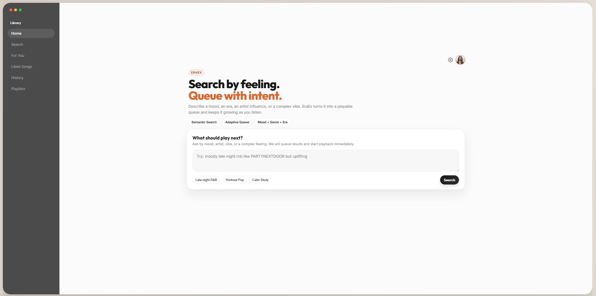
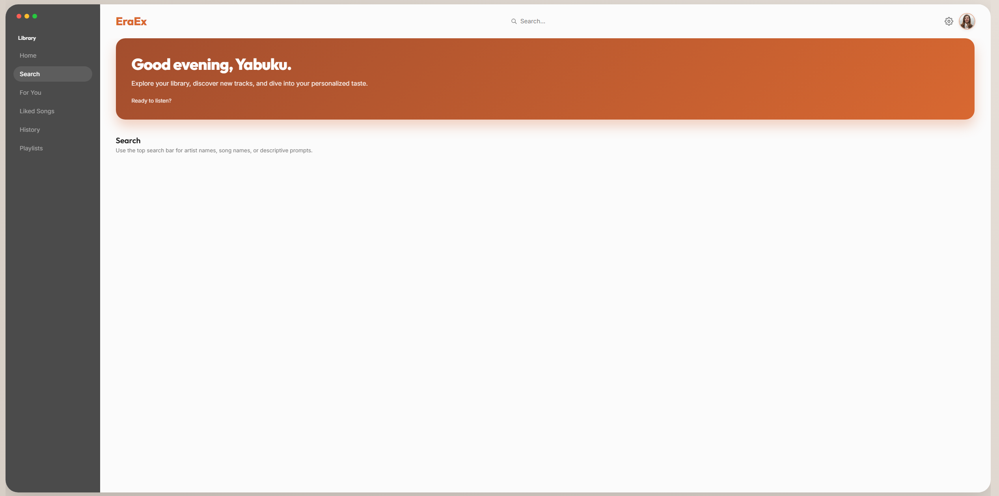
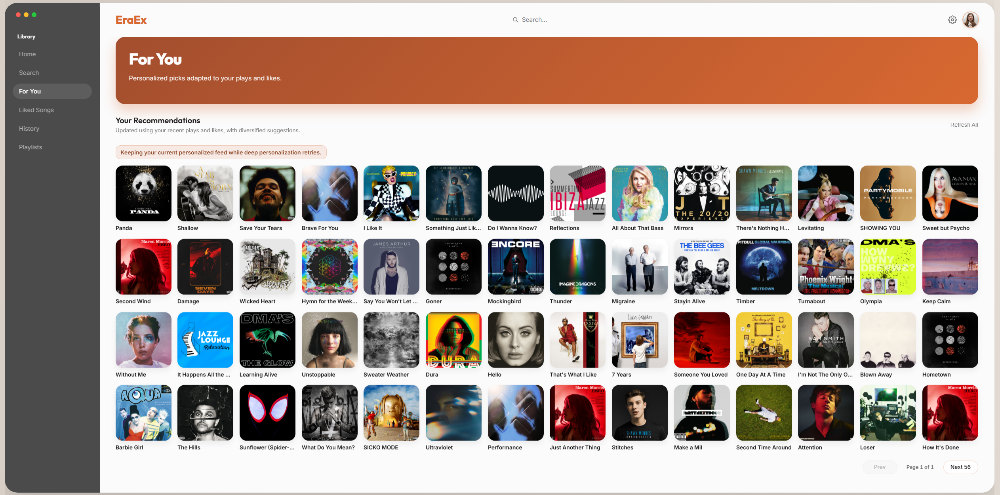
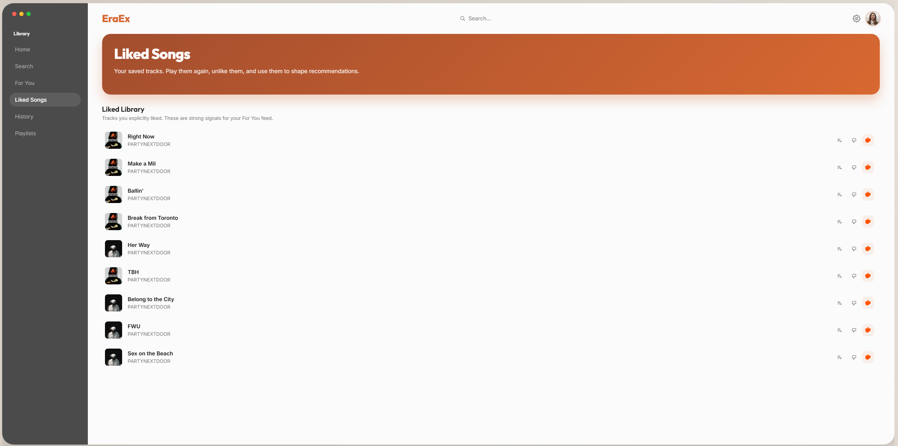
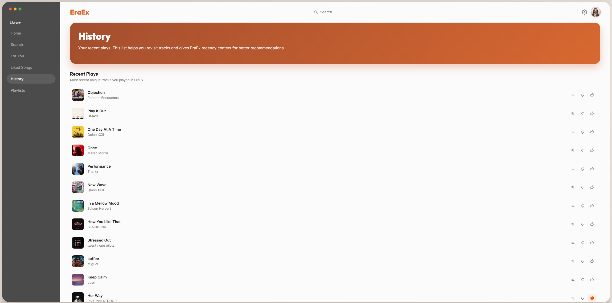
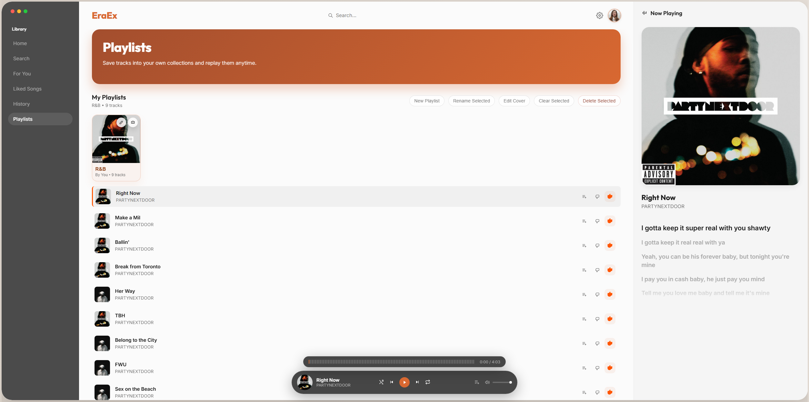

# EraEx

EraEx is a software engineering project focused on building a production-style music platform: semantic retrieval, adaptive recommendations, resilient media integration, and a full-stack web experience.

- **Service architecture:** modular Flask backend, separated search/recommendation/core services, and a componentized web UI.
- **System reliability:** lazy loading, background warmup, multi-layer caching, and fallback paths for media/metadata providers.
- **Data engineering:** FAISS index artifacts, metadata pipelines, and SQLite-backed user/account/profile persistence.
- **Developer productivity:** dedicated CLIs for search debugging, recommendation analysis, maintenance, and offline hyperparameter tuning.

## Architecture At A Glance

### Backend

- `src/web_api/web_app.py`: API layer, routing, auth/session handling, playback and enrichment orchestration.
- `src/search/search_pipeline.py`: semantic retrieval + reranking pipeline (`BAAI/bge-m3` + FAISS + intent-aware scoring).
- `src/recommendation/recommendation_engine.py`: cold-start and adaptive recommendation engine.
- `src/core/media_metadata.py`: YouTube/Spotify enrichment and fallback resolution.
- `src/user_profiles/user_profile_store.py`: SQLite storage for likes, dislikes, plays, skips, playlists, and accounts.

### Frontend

- Server-rendered templates under `src/templates/`.
- Modular JS/CSS under `src/static/`.
- Multi-view UX: Home, Search, For You, Liked, History, Playlists.

## Screenshots

### Home


### Search


### For You


### Liked


### History


### Playlists


## Prerequisites

- Python 3.10+ recommended.
- `yt-dlp` available (the dependency is pinned in `requirements.txt`; binary fallback is also supported).

## Install

### Windows PowerShell

```powershell
py -m venv .venv
.\.venv\Scripts\Activate.ps1
python -m pip install --upgrade pip
pip install -r requirements.txt
```

### Bash / WSL / Linux / macOS

```bash
python -m venv .venv
source .venv/bin/activate
python -m pip install --upgrade pip
pip install -r requirements.txt
```

## Required Runtime Data

Search/recommendation runtime expects index artifacts under `data/indexes`:

- `faiss_index.bin` or `faiss.index`
- `id_map.json` or `track_ids.pkl`
- `metadata.json`

Rebuild these artifacts using `notebooks/full_pipeline.ipynb`.

## Run

```bash
python run.py
```

Open `http://127.0.0.1:5000` (or `http://localhost:5000`).

## Engineering Workflows (CLI)

### Search Debugging

```bash
python -m cli_tools.search_query_cli "midnight drive rnb trap" --limit 10
python -m cli_tools.search_query_cli --artist "Miguel" --song "coffee"
```

### Recommendation Debugging

```bash
python -m cli_tools.foryou_recommendation_cli --user-id <USER_ID>
python -m cli_tools.foryou_recommendation_cli --username <USERNAME> --password <PASSWORD> --fast
```

### Offline Search Tuning

```bash
python -m cli_tools.search_tuning_cli queries.json --trials 60 --report-json tuning_report.json
python -m cli_tools.search_tuning_cli --template-out queries_template.json dummy.json
```

### Data / Maintenance Operations

```bash
python cli_tools/project_maintenance_cli.py enrich --only-missing --limit 1000
python cli_tools/project_maintenance_cli.py audio-features
python cli_tools/project_maintenance_cli.py simulate
python cli_tools/project_maintenance_cli.py subset-test --subset-size 5
python cli_tools/project_maintenance_cli.py clean --dry-run
```

## API Surface (Core Routes)

- `GET /search`
- `GET /sonic`
- `GET /api/recommend`
- `GET /api/trending`
- `GET /api/resolve_video`
- `GET /api/track_enrich`
- `GET /api/lyrics`
- `POST /api/like`
- `POST /api/unlike`
- `POST /api/dislike`
- `POST /api/undislike`
- `POST /api/play`
- `POST /api/skip`
- `GET /api/liked`
- `GET /api/history`
- `GET /api/playlists` and mutation routes under `/api/playlists/*`
- Auth routes under `/api/auth/*`
- Spotify routes under `/api/spotify/*` plus `/spotify/callback`

## Key Environment Variables

- `EMBEDDING_MODEL` (default `BAAI/bge-m3`)
- `FLASK_SECRET_KEY`
- `SESSION_COOKIE_SECURE`
- `SPOTIFY_CLIENT_ID`, `SPOTIFY_CLIENT_SECRET`
- `SPOTIFY_PLAYBACK_ENABLED`, `SPOTIFY_REDIRECT_URI`
- `LYRICA_BASE_URL` (optional lyrics sidecar)
- `HF_TOKEN` or `HUGGINGFACE_HUB_TOKEN` (for notebook/model workflows requiring gated Hugging Face access)

## Project Layout

```text
EraEx/
  assets/                      # README screenshots
  cli_tools/                   # search, recommendation, tuning, maintenance CLIs
  config/settings.py           # global runtime settings
  notebooks/                   # full pipeline and analysis notebooks
  src/
    core/                      # embeddings, media metadata, lazy loading, audio features
    search/                    # semantic retrieval + ranking pipeline
    recommendation/            # recommendation engine
    user_profiles/             # SQLite-backed profile/account storage
    web_api/                   # Flask app and routes
    templates/ + static/       # frontend UI
  run.py                       # startup + warmup entrypoint
```
