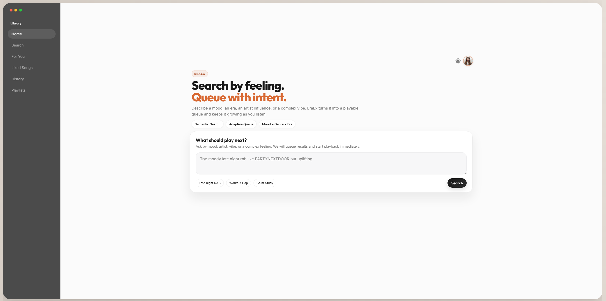

<p align="center">
  
</p>

# EraEx

<p align="center">
  <a href="metrics.md"></a>
  <a href="notebooks/full_pipeline.ipynb"></a>
  <a href="src/recommendation/recommendation_engine.py"></a>
  <a href="https://flask.palletsprojects.com/"></a>
  <a href="https://www.sbert.net/"></a>
  <a href="src/static/js/app.core.js"></a>
</p>

Semantic music discovery app with hybrid search, adaptive recommendations, media fallback, and a multi-view Flask interface.

EraEx combines dense semantic retrieval, intent-aware reranking, behavior-driven "For You" recommendations, SQLite-backed user profiles, and YouTube/Spotify enrichment in one local-first music product. The repo is built around five practical workflows: semantic discovery, explicit search, adaptive recommendations, playlist/history management, and offline maintenance or validation for the ranking stack.

Current tracked stack snapshot: `Flask + BGE-M3 + FAISS + SQLite + yt-dlp`



## Table of Contents

- [Background](#background)
- [Install](#install)
- [Usage](#usage)
- [Configuration](#configuration)
- [Data and Indexes](#data-and-indexes)
- [Repository Layout](#repository-layout)
- [Validation](#validation)
- [Contributing](#contributing)

## Background

EraEx exists to answer a product question that most music apps hide behind generic search: how do you make broad vibe prompts, precise artist lookups, and adaptive personal feeds feel coherent in one system?

The stack currently includes:

- Backend: Flask, SQLite, `python-dotenv`
- Search and ranking: Sentence Transformers, `BAAI/bge-m3`, FAISS, NumPy, SciPy
- Recommendation logic: adaptive similarity scoring, cold-start ranking, DPP-style diversity
- Frontend: server-rendered HTML partials with modular CSS and JavaScript
- Media and metadata: `yt-dlp`, YouTube fallback resolution, optional Spotify enrichment, lyrics provider integration

Core product capabilities:

- semantic and hybrid search across track metadata
- adaptive "For You" recommendations from likes, plays, playlists, and skip behavior
- cold-start trending and diverse fallback recommendations
- playlist, liked, and history surfaces backed by SQLite
- metadata enrichment for descriptions, covers, thumbnails, and lyrics
- CLI and notebook workflows for pipeline rebuilds, tuning, and validation

## Install

### Dependencies

For the default local setup, install:

- Python 3.10+
- `yt-dlp` available on `PATH`

For notebook and analysis workflows, you may also want:

- Jupyter or VS Code notebook support

### Local Environment

Windows PowerShell:

```powershell
py -m venv .venv
.\.venv\Scripts\Activate.ps1
python -m pip install --upgrade pip
pip install -r requirements.txt
```

Git Bash, WSL, Linux, or macOS:

```bash
python -m venv .venv
source .venv/bin/activate
python -m pip install --upgrade pip
pip install -r requirements.txt
```

If PowerShell blocks activation:

```powershell
Set-ExecutionPolicy -Scope Process -ExecutionPolicy Bypass
.\.venv\Scripts\Activate.ps1
```

## Usage

Run the app:

```bash
python run.py
```

The startup flow warms the search pipeline, embedding model, and recommender before serving the web app.

Once the app is running, the public product surface centers on these areas:

- `Home`: semantic discovery prompts and queue-first exploration
- `Search`: explicit song, artist, and hybrid semantic lookup
- `For You`: adaptive recommendations driven by profile behavior
- `Liked`, `History`, and `Playlists`: personal library and replay surfaces

Useful local workflow commands:

```bash
python -m cli_tools.search_query_cli "midnight drive rnb trap" --limit 10
python -m cli_tools.foryou_recommendation_cli --user-id <USER_ID> --fast
python cli_tools/project_maintenance_cli.py enrich --only-missing --limit 1000
python -m compileall src cli_tools config run.py
```

## Configuration

Runtime configuration is centered in [`config/settings.py`](config/settings.py), with `.env` support loaded automatically when present.

Key environment knobs include:

- `EMBEDDING_MODEL` for the sentence-transformer model name
- `FLASK_SECRET_KEY` and `SESSION_COOKIE_SECURE` for session behavior
- `SPOTIFY_CLIENT_ID`, `SPOTIFY_CLIENT_SECRET`, and `SPOTIFY_PLAYBACK_ENABLED`
- `LYRICA_BASE_URL` for optional lyrics sidecar integration
- search and recommendation tuning flags under the `SEARCH_*` and `RECO_*` families

The app also expects generated ranking artifacts under `data/indexes/` for normal search and recommendation fidelity.

## Data and Indexes

EraEx depends on local generated artifacts that are intentionally larger than the tracked source tree.

Important runtime assets:

- `data/indexes/metadata.json`
- `data/indexes/faiss_index.bin` or `data/indexes/faiss_index_ivf.bin`
- `data/indexes/id_map.json` or `data/indexes/track_ids.pkl`
- `data/cache/*` for recommendation and feature caches

Useful rebuild and maintenance entrypoints:

```bash
python cli_tools/project_maintenance_cli.py audio-features
python cli_tools/project_maintenance_cli.py simulate
python cli_tools/project_maintenance_cli.py subset-test --subset-size 5
```

Notebook and build workflows:

- [`notebooks/full_pipeline.ipynb`](notebooks/full_pipeline.ipynb) for end-to-end rebuilds
- [`notebooks/reembed_reindex_colab.ipynb`](notebooks/reembed_reindex_colab.ipynb) for remote embedding/index work

Tracked evaluation support data currently lives in [`metrics.md`](metrics.md).

## Repository Layout

```text
EraEx/
├── assets/                    # README visuals and screenshots
├── cli_tools/                 # debugging, validation, tuning, and optimizer scripts
├── config/                    # runtime settings and environment parsing
├── data/                      # local indexes, caches, eval artifacts, SQLite profiles
├── notebooks/                 # rebuild, reindex, and analysis workflows
├── src/
│   ├── core/                  # embeddings, media metadata, lyrics, lazy loading
│   ├── pipeline/              # maintenance and CLI pipeline glue
│   ├── recommendation/        # cold start and adaptive recommendation logic
│   ├── search/                # semantic retrieval and hybrid reranking
│   ├── static/                # frontend JS, CSS, and assets
│   ├── templates/             # server-rendered HTML partials
│   ├── user_profiles/         # SQLite-backed accounts and library state
│   └── web_api/               # Flask app and route orchestration
├── metrics.md                 # tracked evaluation summary
├── requirements.txt           # Python dependencies
└── run.py                     # startup warmup and app entrypoint
```

## Validation

Current tracked validation evidence includes:

- [`metrics.md`](metrics.md) for search, recommendation, and bot-evaluation summaries
- compile-time verification across the Python source tree

Useful local verification commands:

```bash
python -m compileall src cli_tools config run.py
```

At the moment, the repo does not contain a populated `pytest` test suite, so validation is centered on compile checks, offline metrics, and CLI-driven evaluation.

## Contributing

Focused pull requests are welcome. When proposing a change:

- keep the README aligned with the actual product surface
- do not commit large local index artifacts or private environment files
- include the verification steps you used for search, recommendation, or UI changes
- prefer small, reviewable changes when touching ranking logic or maintenance workflows
